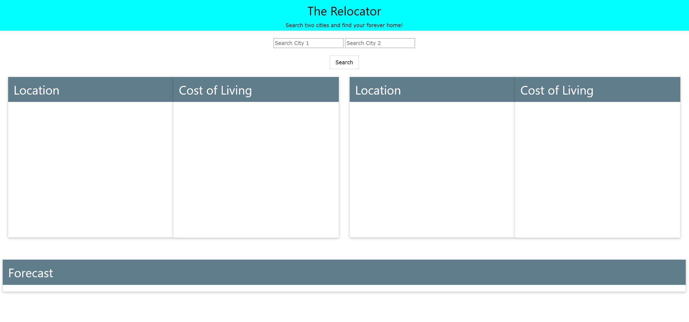

# Code Quiz

## Description
    
When the player starts the game they have 75 seconds to complete the quiz. Every wrong answer takes time off the clock. The final score is the time left on the clock.
    
## Table of Contents
1. [Installation](#installation)
2. [Usage](#usage)
3. [License](#license)
4. [Contributing](#contributing)
5. [Tests](#tests)
6. [Questions](#questions)
    
## Installation
    
Click on the link below!
    
[Link to Code Quiz](https://mikecoletta.github.io/Code-Quiz/)
    
## Usage
    

    
## License
    
MIT License 
    
Copyright (c) 2021 Mike Coletta
    
## Contributing
    
Mike Coletta

    
## Tests
    

    
## Questions?
    
[Mike Coletta Github](https://github.com/MikeColetta)
    
For any questions, please send me an [email](coletta.mike@gmail.com).